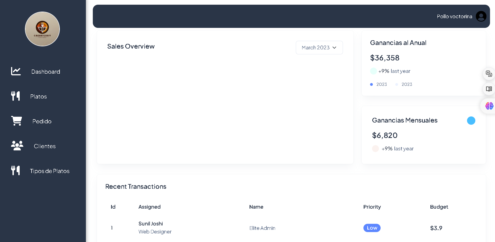
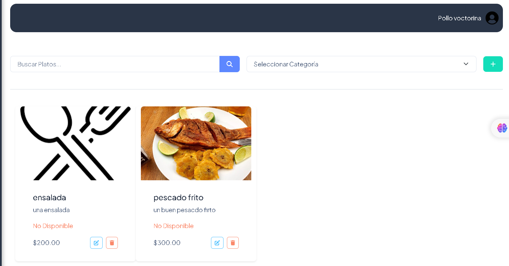
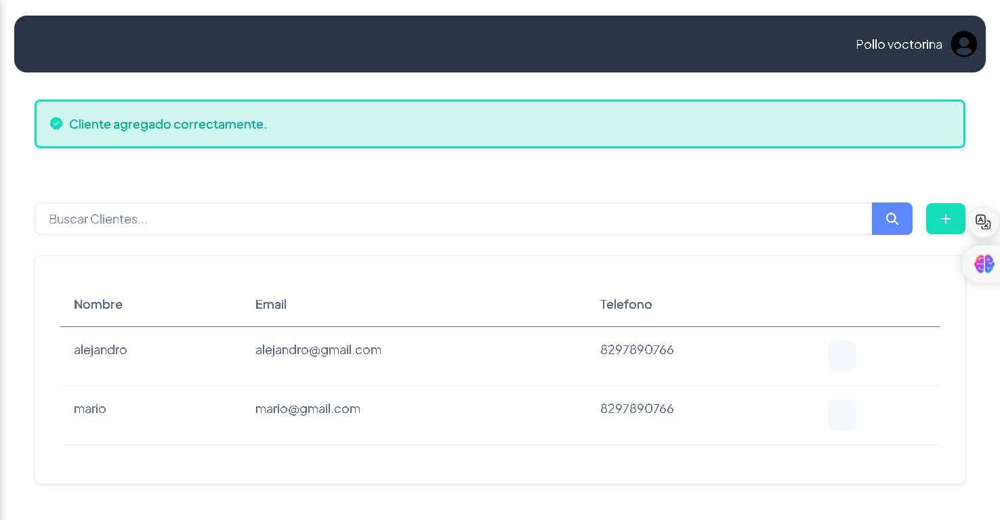

Aquí tienes una versión mejorada de tu README con imágenes sugeridas para cada sección:

# App Administradora de Restaurantes

## Descripción
Esta aplicación permite la administración eficiente de platos, clientes y pedidos en un restaurante. Ofrece funcionalidades clave para gestionar el negocio, mejorar la experiencia del cliente y optimizar el flujo de pedidos.


---

## Secciones

### Login
aqui inicia sesion los restaurantes para manejar su negocio


### Dashboard
En el Dashboard, puedes visualizar las métricas más importantes del negocio, como las ventas totales, los clientes más frecuentes y el rendimiento general del restaurante.



---

### Plato
Esta sección permite agregar, modificar y eliminar platos del menú. Cada plato puede tener un nombre, precio, descripción y una imagen (subida desde la PC o URL).



---

### Cliente
Gestiona la información de los clientes, incluyendo los clientes más frecuentes y sus historiales de pedidos, para ofrecer un mejor servicio y fidelización.



---

### Perfil
Los usuarios pueden crear y actualizar su perfil, cambiar contraseñas y gestionar sus preferencias para una experiencia personalizada.


---

## Requisitos
- **.NET Core/Framework:** Instalar la versión necesaria de .NET para ejecutar la aplicación.
- **SQL Server:** Asegúrate de configurar correctamente la cadena de conexión (`connection string`) para vincular la base de datos.


---

## Instalación y Ejecución

1. Clona el repositorio:  
   ```bash
   git clone https://github.com/usuario/app-restaurante.git
   ```

2. Configura el archivo de conexión a la base de datos (`appsettings.json`):
   ```json
   "ConnectionStrings": {
       "DefaultConnection": "Server=localhost;Database=restaurante;User Id=usuario;Password=contraseña;"
   }
   ```

3. Ejecuta la aplicación en tu entorno de desarrollo con Visual Studio o mediante la línea de comandos:
   ```bash
   dotnet run
  


---

## Estado del Proyecto

> **⚠️ Importante:** La aplicación está en desarrollo y puede experimentar cambios importantes a medida que se agregan nuevas características y mejoras.


---

Este README ahora proporciona una estructura más clara y añade contexto visual que puede ayudar a entender mejor cada sección. Puedes reemplazar los enlaces de imagen con imágenes reales de tu proyecto si tienes capturas de pantalla o gráficos que correspondan a cada sección.